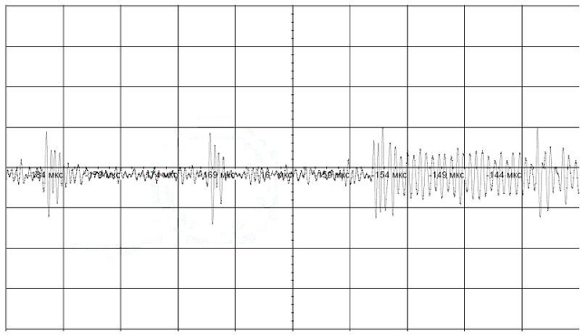
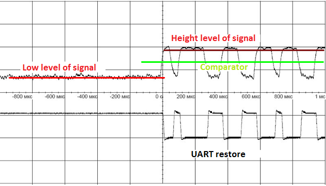

#PLC Modem ( PowerLine Modem )

Power-line communication (PLC) carries data on a conductor that is also used 
simultaneously for AC/DC electric power transmission.

## Introduction

What is interesting about PowerLine? It's no additional wiring is required.
Most of the devices in the modern world are powered by external sources by
wires. Radio modules in their mass are no exception. Power can be either a
constant current of 12-24V or alternating current of 110V - 220V. For transmit of
information it does not matter if there is voltage in the line or not, you need
only two wires.

Block diagram of the modem

A modem is a device that modulates the UART signal with a radio frequency. The
signal modulation method is CW, the frequency is 1.84 MHz (160 m). The UART
speed is 2400-19200 bps.

The circuit is designed with minimum amount of parts surrounding the
microcontroller and maximum "pleasure", i.e., the load on the microcontroller
is minimized. The hardware capabilities of the microcontroller are used as much
as possible.

The microcontroller can perform tasks with sensors, load control (relays,
triacs), etc.

## How it work

Because Our modem is most likely to work in an environment with other modems,
eg modems G3 Prime, HomePlug, ... then the task is to filter out frequencies
not included in the frequency range we used when receiving the signal.

The filter is designed for a cut-off frequency of 1 MHz (low
frequencies). Those. All that is lower, including a 50-60 Hz network is not
visible in principle. The resonance frequency of the oscillatory circuit is
approximately 1.5-2 MHz. The ferrite is selected for which the operating
frequency is approximately 1.8 MHz. Our required frequency is 1.84 MHz. At
the resonance frequency, the amplitude amplification (simulation) is
approximately 100-120 times. But taking into account the physical limitations
of ferrite, the real resonance was obtained at the frequencies 1.8 - 1.9 MHz,
All what lower and higher is cut.
But taking into account the physical limitations
of ferrite, the real resonance was obtained at the frequencies 1.8 - 1.9 MHz,
and is approximately 15-30 times in amplitude. It is what we need.

For receiving / transmitting, UART3 is used.

## Transmission mode

As a meander of 1.84 MHz, PWM is used. The percent of infill is 0 and
50%. The signal (Tx) is the control. The control signal is routed to PWM,
which generates an interrupt when the state changes. The state of PWM has
changed to a low - set up 50% PWM filling. The state has changed to a high -
set up 0% infill. The signal PWM is amplified. The circuit is designed for a
resonance frequency of 1.84 MHz. The output of the transformer coil will be
a "pure sine".

To block the reception signal during transmission (turning off the "echo"), it
is enough to set 3.3V on the output of DAC (PB1), at that the receiving signal
level will never exceed 2V and the comparator will never turn on. The signal
will not be accepted.

Modulated signal UART (output) on coil

## Receive Mode

The recieve coil of the transformer has no "tricky" functions. Works as a
transformer coil in order to separate the receiving and transmitting lines.
Next - a two-stage amplifier. Amplifier (k-t gain
approximately 250 times). Linearity does not interest us, the task is to
maximize amplification. The current amplifier, the detector and the
UART signal inverter, plus the amplitude-limiting filter (cuts short bursts -
where the noise frequency coincided with our operating frequency and was
summed). Do not confuse the circuit of the inclusion of this transistor as an
emitter follower, it is not, the mode of operation is completely different.

Input signal

The modem was tested on a noisy power line. The signal-to-noise ratio can be up
to 15-20 dB.

Increased fragment of the input signal.

separate impulses are noise in the line.

Figure shows how the bandpass filter works, the signal frequency is 1.84 MHz.

## Detecting of the UART signal

The input of the microcontroller ADC, continuously scans the received and
detected signal. The data is sent in the DMA mode to the ring buffer. Depending
on the distance of the signal source, the upper boundary will "float". The
problem is to find the middle between the signal "zero" and the upper boundary.
This will be the optimum for the comparator. The calculated voltage is set on
the DAC (input of comparer). The figure below explains how it looks.

Calculation of the optimal voltage

The upper oscillogram is the output, the lower one is the
output of the comparator, the recovered signal is UART.

Further, the restored UART signal Rx is applied to the
hardware UART. By receiving a byte, an interrupt is triggered, in which we
analyze the state of data reception: whether all data is received in accordance
with the protocol, encoding / decoding Hamming, etc.

## Protocol

The protocol of data exchange can be practically anything. For example MODBUS.
The device number and speed are recorded in the microcontroller. I use a
protocol similar to CAN, except for broadcast commands. Speed settings and
device numbers are produced by any terminal (eg terraterm, Putty, ...) using a
USB-UART device.

## Test of line

Testing of modems was carried out on a line with a maximum length of 150 m.
There was not a longer line "at hand". At the maximum length, you need to
conduct tests and see real the signal attenuation.

Given the voltage drop in the wires for direct current, for 24V the length of
the wire (segment) can reach 300-350 meters. A pair of modems can be used as a gateway
between power line segments. For example, the transmission protocol between the gateway of modems can be CAN.
